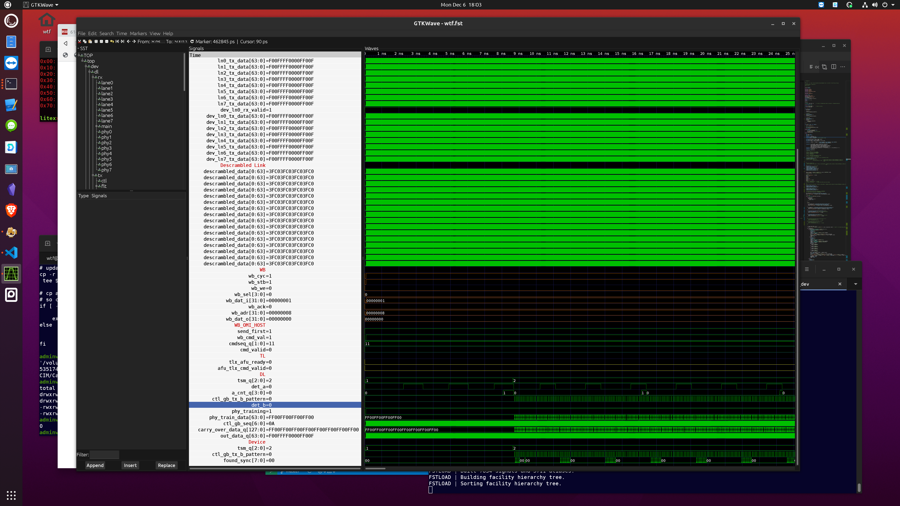
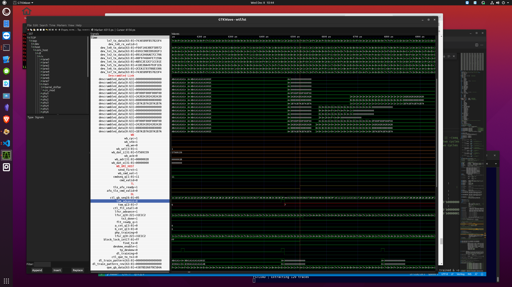

# Sim

* add remote DL to new top and try to train

```
verilator --cc --exe --trace -Wno-fatal -Wno-Litendian -Isrc -I./src/dl -I./src/tl top.v tb.cpp

cd obj_dir;make -f Vtop.mk;cd ..
obj_dir/Vtop

gtkwave wtf.vcd wtf.gtkw

# optional - looks like it creats 'aet'-like file, which is wayyy smaller
#-rw-rw-r--  1 wtf wtf    6000182 Dec  6 17:54 wtf.fst
#-rw-rw-r--  1 wtf wtf       4028 Dec  6 17:51 wtf.gtkw
#-rw-rw-r--  1 wtf wtf 1434765012 Dec  6 17:53 wtf.vcd
vcd2fst wtf.vcd wtf.fst
```

* need dl link up

   * transmitting bits but not advancing yet

   * ocx_dlx_xlx_if.v is specific logic for xilinx phy; this is what should be exposed to external phy logic if want to use multiple
     'phy'; eventually remove it from dl (can use for Xil PHY logic)


* changed tsm_q reset value so don't have to step training manually ('fire' change for xil phy)

* pattern_a (bits) completes but pattern_b (alignment) not being detected



* during pattern a, b, sync, there is no header data; so the 64b shifts over the 66b hdr+data

* link up

   * took several changes to counters - because they assume a minimum wire length?  need to be configurable

   * removed 2-flit forced hiccup - tuning req'd for specific fire implementation on xil?



## device tl

   * host tl (..tlx..v) can't be used w/o modification because crediting is built into
   tl logic (rtl above tl can't send a credit return rsp since it's not detected as special (credit-ignore)), but there is dedicated logic to do framer/parser credit tx/rx

      * added GEMINI_NOT_APOLLO to tl and swap 01/08 opcodes based on that (rx and tx)

      * so far 1/4 vc (vc0, tl) got credits 😄 or 😢


## halfway

```
Seed=08675309
Resetting host, holding dev..
Go!
DLX Config: 00000000
startRetrain=0
cyc=00000007 Write @0000033c sel=6 data=731e58f3 mem=3a31333b->3a1e583b
Releasing dev..
cyc=00000100
cyc=00000200
cyc=00000300
cyc=00000400
cyc=00000500
cyc=00000600
cyc=00000651 DL says link is up!
cyc=00000651 TL says ready!
cyc=00000651 DLX says link is up!
cyc=00000651 TLX says ready!
cyc=00000700
cyc=00000800
cyc=00000900
cyc=00001000
Quiescing...
Quiescing...
Request is outstanding!
Done.

You are worthless and weak!

Seed=08675309
```

## yapping wb->omi_host->omi_dev->omi_host->wb

```
...
cyc=00999300
cyc=00999336 ACK RD  data=15c6b3bc
cyc=00999337 Write @00000010 sel=6 data=726dbd77 mem=7e779a6e->7e6dbd6e
cyc=00999391 ACK WR
cyc=00999395 Write @00000020 sel=0 data=05d9f50e mem=626ccf86->626ccf86
cyc=00999400
cyc=00999449 ACK WR
cyc=00999453 Read @00000004
cyc=00999500
cyc=00999507 ACK RD  data=18aae923
cyc=00999508 Read @00000038
cyc=00999562 ACK RD  data=2fe73d16
cyc=00999564 Read @0000003c
cyc=00999600
cyc=00999618 ACK RD  data=15c6b3bc
cyc=00999620 Read @00000014
cyc=00999674 ACK RD  data=0f203882
cyc=00999675 Read @00000008
cyc=00999700
cyc=00999729 ACK RD  data=67217a93
cyc=00999732 Write @0000000c sel=1 data=49cd9874 mem=2afc6d7e->2afc6d74
cyc=00999786 ACK WR
cyc=00999787 Write @00000028 sel=8 data=551c9319 mem=7634bdbe->5534bdbe
cyc=00999800
cyc=00999841 ACK WR
cyc=00999842 Read @0000003c
cyc=00999896 ACK RD  data=15c6b3bc
cyc=00999897 Write @00000008 sel=6 data=3f2ebe1f mem=67217a93->672ebe93
cyc=00999900
cyc=00999951 ACK WR
cyc=00999955 Read @00000028
cyc=01000000
Quiescing...
cyc=01000009 ACK RD  data=5534bdbe
cyc=01000100
Quiescing...
Done.

You has opulence.

Seed=08675309

```


